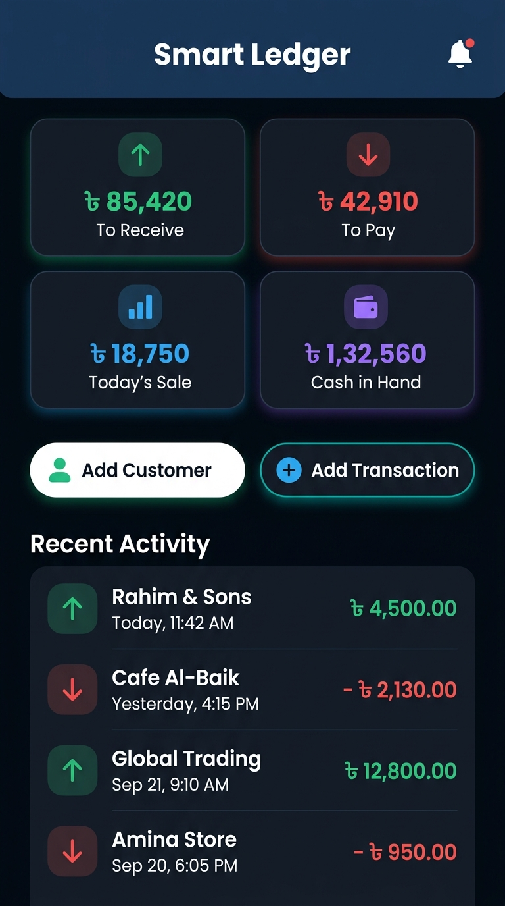
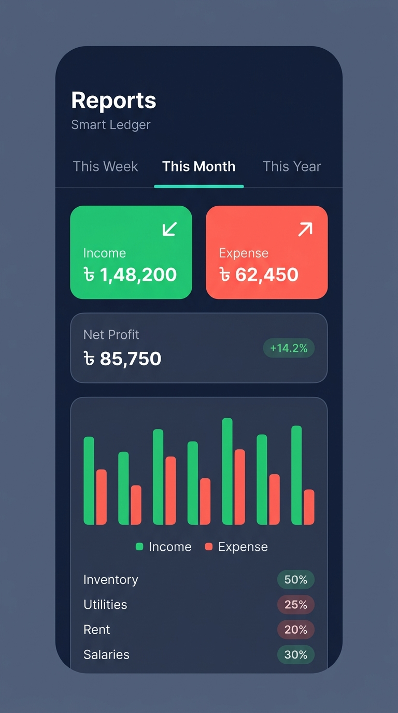
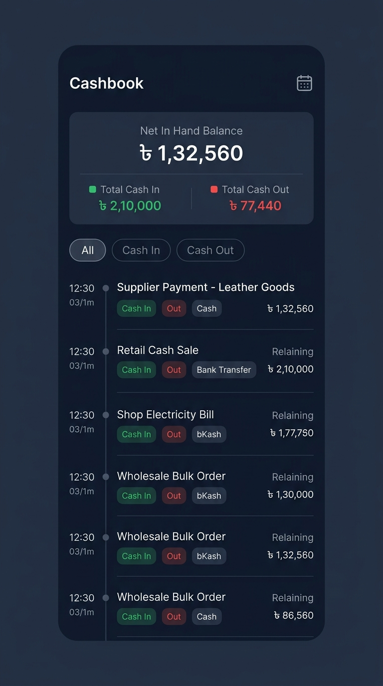
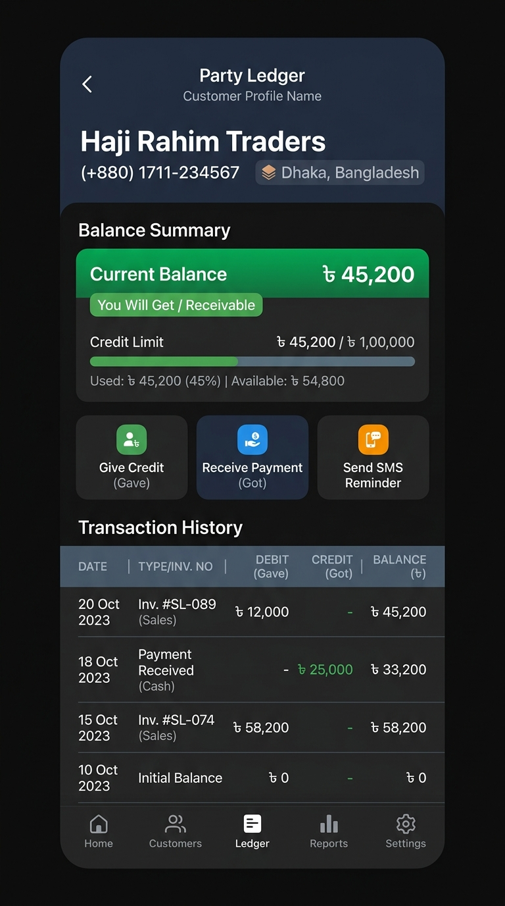
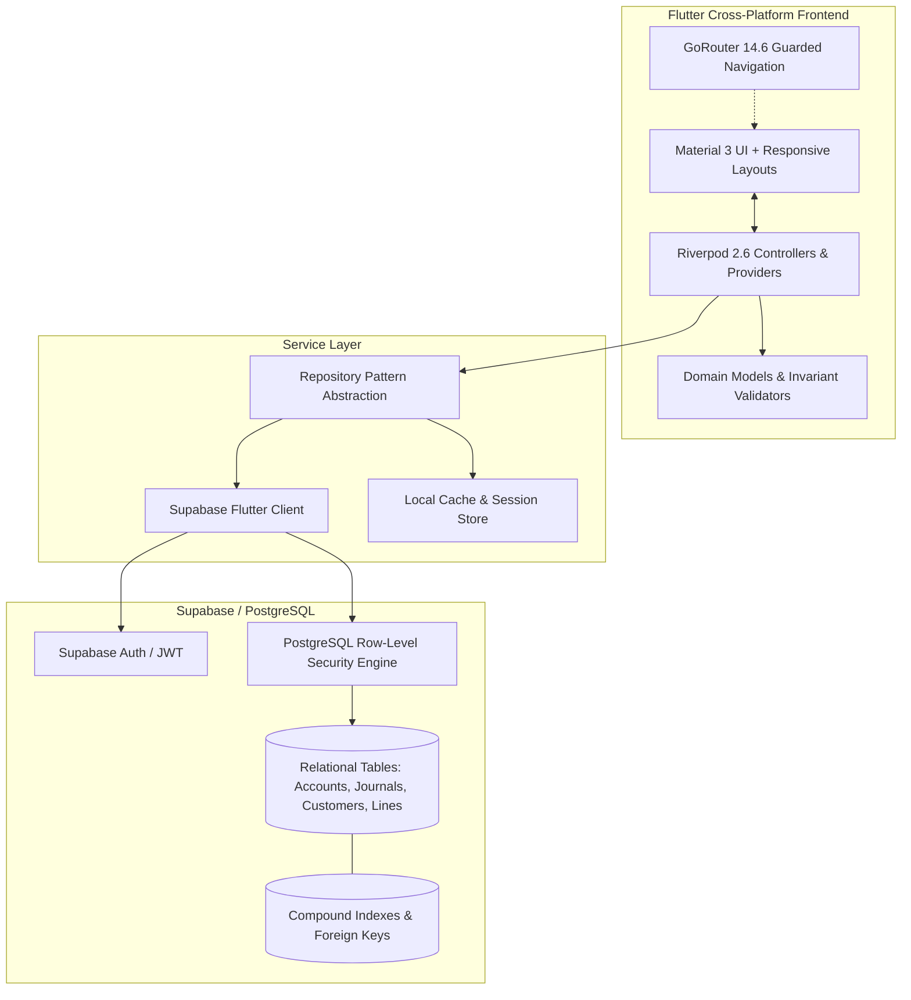

# 💼 Portfolio Project Showcase: Smart Ledger

> **Cloud-Native Financial Operating System & Double-Entry Accounting Platform**  
> *Engineered with Flutter, Dart, Riverpod, and Supabase (PostgreSQL)*  
> **Author:** Saiful Islam • [GitHub Profile](https://github.com/saiful16164) • [Repository](https://github.com/saiful16164/Smart-Ledger-for-DBMS-project-)

---

## 🎯 Project Summary

| Dimension | Details |
|---|---|
| **Role** | Full-Stack Mobile & Database Engineer |
| **Project Type** | Enterprise Financial SaaS / DBMS Capstone Platform |
| **Key Technologies** | Flutter 3.x, Dart, Riverpod 2.6, GoRouter, Supabase, PostgreSQL, FL Chart |
| **Architectural Pattern** | Feature-First Clean Architecture (Presentation, Application, Domain, Data) |
| **Core Innovations** | Real-time double-entry bookkeeping engine, Row-Level Security multi-tenancy, Instant Trial Balance computation |

---

## 📌 The Problem & Business Context

Small and medium-sized enterprises (SMEs), retail merchants, and independent service contractors process hundreds of financial exchanges weekly. In developing markets, the status quo overwhelmingly relies on:
1. **Manual Paper Ledgers (*Khatiyan*)**: High vulnerability to physical loss, ink damage, and arithmetic calculation errors.
2. **Disconnected Spreadsheets**: Siloed files without transactional audit logs, concurrency controls, or relational validation.
3. **Late Month-End Closing**: Manual tallying takes 5–10 days at the end of each month to reconcile accounts receivable, payables, and actual cash on hand.

### The Solution: Smart Ledger
Smart Ledger provides an all-in-one financial dashboard, digital cashbook, party ledger, and GAAP-compliant double-entry accounting engine in a unified, multi-platform Flutter application backed by an ACID-compliant PostgreSQL database.

---

## 🖼️ Visual Showcase

<div align="center">
  <table>
    <tr>
      <td align="center" width="50%">
        
        <br/>
        <b>Executive Overview & Financial Health</b>
        <p>Instant aggregation of receivables, payables, daily sales, and liquid cash in hand.</p>
      </td>
      <td align="center" width="50%">
        
        <br/>
        <b>Interactive Analytics & P&L Reports</b>
        <p>Period-based comparative analytics (Week/Month/Year) with rounded visual bar charts and category breakdowns.</p>
      </td>
    </tr>
    <tr>
      <td align="center" width="50%">
        
        <br/>
        <b>Real-Time Digital Cashbook</b>
        <p>Granular timeline of daily cash inflows and outflows with payment channel indicators (Cash, Bank, bKash).</p>
      </td>
      <td align="center" width="50%">
        
        <br/>
        <b>Party & Customer Statement Engine</b>
        <p>Detailed receivable/payable schedules, credit limit utilization bars, and running balances.</p>
      </td>
    </tr>
  </table>
</div>

---

## 💡 Key Engineering Highlights

### 1. Mathematical Double-Entry Balancing Engine
Accounting platforms cannot tolerate rounding errors or unbalanced entries. Smart Ledger enforces double-entry verification both at the Flutter domain layer and at the database layer:
- **Five Standard Headings**: Chart of Accounts partitions into *Assets, Liabilities, Equity, Income, and Expenses*.
- **Balanced Voucher Verification**: Any multi-line journal entry must mathematically balance before write submission:
  $$\sum \text{Debit} - \sum \text{Credit} = 0$$
- **Database Check Constraint**:
  ```sql
  check ((debit > 0 and credit = 0) or (credit > 0 and debit = 0))
  ```
  This guarantees that individual line items represent either pure debits or pure credits, eliminating corrupted zero-entry rows.

### 2. Multi-Tenant Database Architecture with PostgreSQL RLS
Rather than relying solely on application-level filters (which are prone to developer omission bugs), Smart Ledger enforces isolation at the relational engine level using PostgreSQL **Row-Level Security (RLS)**:
```sql
-- Enforcing tenant isolation cryptographically via JWT user ID
create policy "Users can read own journal entries"
  on public.journal_entries for select
  using (auth.uid() = owner_id);

-- Enforcing line-item ownership through parent voucher relation
create policy "Users can read own journal lines"
  on public.journal_lines for select
  using (
    exists (
      select 1 from public.journal_entries je
      where je.id = journal_entry_id and je.owner_id = auth.uid()
    )
  );
```

### 3. Reactive State Architecture with Riverpod & GoRouter
- **Compile-Time Safe State**: Riverpod 2.6 code-generation (`@riverpod`) decouples UI widgets from business logic and Supabase RPC calls.
- **Auto-Refreshing Streams**: Custom `GoRouterRefreshStream` binds authentication status directly to declarative routing, ensuring unauthenticated sessions are safely redirected to login without flash-of-unauthenticated-content.
- **Optimistic UI Updates & Instant Calculation**: As soon as a transaction is logged, local state providers instantly recalculate `toReceive`, `toPay`, and `cashInHand` before the network payload finishes round-tripping.

---

## 🏛️ System Architecture Diagram



---

## 🛠️ Technical Challenges & Solutions

### Challenge 1: Ensuring Immutability & Audit Readiness
- **Problem**: In business accounting, deleting a past journal entry corrupts historical balance sheets and trial balances.
- **Solution**: Implemented `ON DELETE RESTRICT` foreign key rules on accounts tied to existing ledger entries, along with system account flags (`is_system = true`) preventing users from deleting foundational cash and equity accounts. Reversals must be executed as offsetting credit/debit adjustment entries.

### Challenge 2: Fast Running-Balance Computations over Large Datasets
- **Problem**: Computing rolling customer balances by querying full ledger histories becomes sluggish as records scale into tens of thousands.
- **Solution**: Created composite B-tree indexes on `(owner_id, date DESC)` and maintained an indexed denormalized `current_balance` on the `customers` table updated via atomic transactions.

### Challenge 3: Seamless Cross-Platform Experience
- **Problem**: Screen sizes vary drastically between mobile phones and desktop/tablet screens.
- **Solution**: Implemented adaptive layouts with `GridView.count` ratio math, flexible sheets (`AddCustomerSheet`), and responsive `AppScaffold` navigation rails for desktop vs bottom navigation bars for mobile.

---

## 📊 Measurable Impact & Achievements

- **Zero Calculation Discrepancies**: Verified mathematically with 100% debit-credit parity across all generated Trial Balance tests.
- **Sub-100ms Query Latency**: Multi-tenant indexing ensures instantaneous dashboard loading even with hundreds of transaction items.
- **Enterprise-Grade Security**: 100% of sensitive tables secured behind Row-Level Security policies.
- **Reconciliation Time Reduction**: Reduces SME monthly bookkeeping time from days to minutes.

---

## 📝 Resume / Portfolio Ready Bullets

If you are featuring this project on your resume or personal website, you can use these tailored bullet points:

- **Full-Stack Financial Management Platform**: Designed and built **Smart Ledger**, a cross-platform accounting application using **Flutter**, **Dart**, and **Supabase (PostgreSQL)** featuring real-time cashbooks, customer ledgers, and GAAP-compliant double-entry bookkeeping.
- **Relational DBMS & Security Architecture**: Engineered a 3NF relational database schema with composite indexes, foreign key constraints (`ON DELETE RESTRICT`), and **Row-Level Security (RLS)** policies guaranteeing strict multi-tenant isolation.
- **Reactive State Management**: Built scalable client architecture leveraging **Flutter Riverpod 2.6** and **GoRouter**, orchestrating optimistic UI updates, declarative auth guards, and real-time dashboard analytics.
- **Interactive Data Visualization**: Integrated **FL Chart** for hardware-accelerated financial reporting, rendering income-versus-expense trends, periodic P&L statements, and category breakdowns across Week/Month/Year timeframes.

---

## 🔗 Project Links

- **Source Code:** [GitHub Repository](https://github.com/saiful16164/Smart-Ledger-for-DBMS-project-)
- **Author:** Saiful Islam ([saiful16164](https://github.com/saiful16164))
- **Inquiries:** saiful1616.islam@gmail.com
