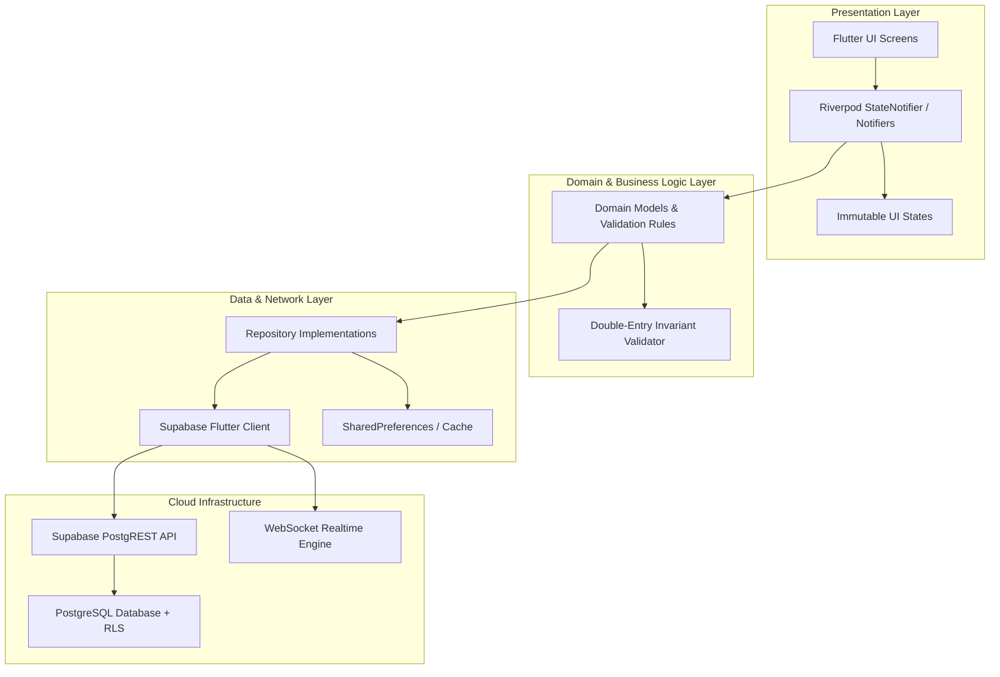
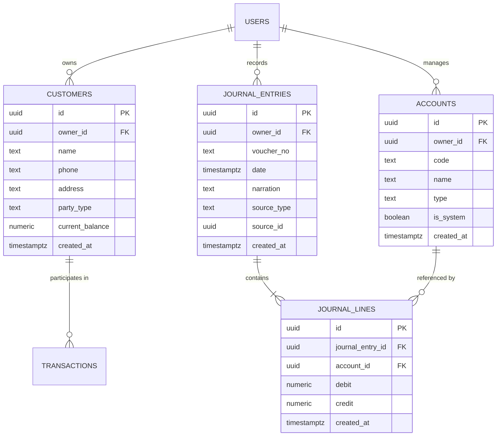

# 🪙 Smart Ledger — Cloud-Powered Financial Management Platform

<div align="center">

[](https://flutter.dev)
[](https://dart.dev)
[](https://supabase.com)
[](https://riverpod.dev)
[](LICENSE)

<p align="center">
  <b>A modern, cross-platform financial operating system and double-entry bookkeeping platform engineered for SMEs, merchants, and contractors.</b>
</p>

[Key Features](#-key-features) •
[App Showcase](#-app-showcase) •
[Architecture](#-system-architecture) •
[Database Design](#-database-design--dbms-highlights) •
[Getting Started](#-getting-started) •
[Portfolio Case Study](#-portfolio-case-study)

</div>

---

## 📌 Overview

Traditional small-to-medium enterprises (SMEs) and independent contractors often struggle with fragmented accounting workflows—relying on manual ledger books (*khatiyan*), disjointed spreadsheets, and delayed reconciliations. These practices lead to cash-flow blindspots, calculation mistakes, and high administrative overhead.

**Smart Ledger** solves this by providing a unified, real-time financial hub. Built with **Flutter** for cross-platform responsiveness and backed by **Supabase (PostgreSQL)** with strict **Row-Level Security (RLS)**, Smart Ledger combines daily transaction tracking (Cashbook & Party Ledger) with rigorous **Double-Entry Accounting** (Chart of Accounts, Journal Entries, General Ledger, and Trial Balance).

---

## 📱 App Showcase

<div align="center">
  <table>
    <tr>
      <td align="center" width="50%">
        
        <br/>
        <b>Executive Financial Dashboard</b>
        <p><i>Real-time KPIs: To Receive, To Pay, Today's Sales, Cash in Hand, and quick actions</i></p>
      </td>
      <td align="center" width="50%">
        
        <br/>
        <b>Analytics & Financial Reporting</b>
        <p><i>Period comparisons (Week/Month/Year), Net Profit tracking, and expense breakdown charts</i></p>
      </td>
    </tr>
    <tr>
      <td align="center" width="50%">
        
        <br/>
        <b>Unified Digital Cashbook</b>
        <p><i>Real-time Cash In / Cash Out timelines, date range filtering, and payment channel tags</i></p>
      </td>
      <td align="center" width="50%">
        
        <br/>
        <b>Customer & Party Ledger</b>
        <p><i>Receivables aging, credit limits, payment histories, and automated balance calculation</i></p>
      </td>
    </tr>
  </table>
</div>

---

## ✨ Key Features

### 1. 📊 Executive Financial Dashboard
- **Instant Health Check**: 4 core financial indicators at a glance: *To Receive*, *To Pay*, *Today's Sale*, and *Cash in Hand*.
- **Quick Logging**: Fast one-tap actions for adding parties, credit entries, and sales transactions.
- **Live Activity Feed**: Up-to-the-minute stream of business operations with income/expense color cues.

### 2. 📖 Party & Customer Ledger
- **Party Types**: Supports both customers (receivables) and suppliers/vendors (payables).
- **Dynamic Credit Balances**: Automatically tallies balance owed, credit utilization, and credit limits.
- **Full Statement Drilldown**: Complete ledger statement per customer with transaction history, invoice numbers, and running balances.

### 3. 💵 Digital Cashbook
- **Dual Cashbook Tracking**: Record cash in-flows (sales, customer collections) and out-flows (expenses, vendor settlements).
- **Multi-Method Support**: Tag transactions by Cash, Bank Transfer, or Mobile Financial Services (MFS / bKash).
- **Temporal Filtering**: Date range filtering for daily, weekly, or custom audit intervals.

### 4. ⚖️ Enterprise Accounting Module (Double-Entry Engine)
- **Chart of Accounts (CoA)**: Categorizes accounts into the 5 GAAP standard pillars: *Assets, Liabilities, Equity, Income, and Expenses*.
- **Journal Entries & Vouchers**: Implements strict double-entry verification:
  $$\sum \text{Debit} = \sum \text{Credit}$$
- **General Ledger**: Auto-generated ledger books mapping transactions to corresponding accounts.
- **Trial Balance**: Instant verification of debit-credit equality to ensure zero mathematical discrepancies.

### 5. 📈 Visual Reporting & Analytics
- **Dynamic Periodic Breakdown**: Filter analytics by Week, Month, or Year.
- **Interactive FL Chart Visualizations**: Rounded dual-bar comparisons of income vs expenses.
- **Expense Categorization Breakdown**: Proportional breakdown of business costs (Inventory, Utilities, Rent, Salaries).

### 6. 🔒 Multi-Tenant Security & Cloud Sync
- **Supabase Authentication**: Secure email/password login and token-based session persistence.
- **PostgreSQL Row-Level Security (RLS)**: Enforces cryptographic multi-tenancy at the database layer—users can strictly access only their own financial data.

---

## 🏗️ System Architecture

Smart Ledger adheres to **Feature-First Clean Architecture** principles, combining declarative UI, unidirectional data flow, and isolated domain services:



### Tech Stack

| Layer | Technology | Purpose |
|---|---|---|
| **Frontend Framework** | [Flutter 3.x](https://flutter.dev) | Cross-platform UI (Android, iOS, Web, Desktop) |
| **Language** | [Dart 3.8+](https://dart.dev) | Type-safe, null-safe client runtime |
| **State Management** | [Flutter Riverpod 2.6](https://riverpod.dev) | Reactive, compile-time safe dependency injection |
| **Routing** | [GoRouter 14.6](https://pub.dev/packages/go_router) | Declarative routing with authentication guards |
| **Charts & Graphs** | [FL Chart 0.70](https://pub.dev/packages/fl_chart) | Hardware-accelerated financial charts |
| **Database & Backend**| [Supabase (PostgreSQL)](https://supabase.com) | Relational database, Auth, and Real-time WebSockets |
| **Security** | PostgreSQL Row-Level Security (RLS) | Multi-tenant isolation enforced in DB engine |

---

## 🗄️ Database Design & DBMS Highlights

Smart Ledger was built as part of an advanced Database Management Systems (DBMS) project. The schema enforces **Third Normal Form (3NF)** with strict referential integrity, check constraints, and indexed access paths.



### DBMS Implementation Highlights:
1. **Double-Entry Constraint Check**:
   `journal_lines` enforces that every single line item is strictly either debit or credit:
   ```sql
   check ((debit > 0 and credit = 0) or (credit > 0 and debit = 0))
   ```
2. **Referential Deletion Protection**:
   `account_id` in `journal_lines` has `ON DELETE RESTRICT`, preventing accidental removal of accounts containing transactional history.
3. **Compound Multi-Tenant Indexes**:
   Queries are optimized using composite indexes:
   ```sql
   create index journal_entries_owner_id_date_idx on public.journal_entries(owner_id, date desc);
   ```
4. **Row Level Security (RLS)**:
   Every query automatically appends tenancy verification via `auth.uid() = owner_id`.

---

## 📁 Project Structure

```
smart_ledger/
├── assets/
│   └── screenshots/         # App screenshots & preview assets
├── lib/
│   ├── app.dart             # Root MaterialApp & theme configuration
│   ├── main.dart            # App entry point & Supabase initialization
│   ├── core/
│   │   ├── constants/       # App-wide constants
│   │   ├── router/          # GoRouter definitions & auth redirection
│   │   ├── services/        # Supabase client singleton & storage
│   │   ├── theme/           # AppColors, typography, Light & Dark themes
│   │   ├── utils/           # Formatters, currency helpers, date utilities
│   │   └── widgets/         # AppScaffold, responsive shells, custom cards
│   └── features/
│       ├── accounting/      # Chart of Accounts, Journal, Ledger, Trial Balance
│       ├── auth/            # Login, Signup, Session controllers
│       ├── cashbook/        # Cash in/out ledger & timeline
│       ├── customers/       # Customer profiles, statements, party ledger
│       ├── dashboard/       # Metric cards, KPI calculations, recent activity
│       ├── reports/         # P&L, period analytics, FL Charts
│       ├── settings/        # Preferences, support, privacy policy
│       └── transactions/    # Transaction entry, category mapping
├── supabase/
│   └── migrations/          # Production SQL schema & RLS policies
└── test/                    # Unit and widget tests
```

---

## 🚀 Getting Started

### Prerequisites
- [Flutter SDK](https://flutter.dev/docs/get-started/install) (version `3.8.1` or higher recommended)
- [Dart SDK](https://dart.dev/get-dart)
- A [Supabase](https://supabase.com) project (or local Supabase CLI)

### 1. Clone the Repository
```bash
git clone https://github.com/saiful16164/Smart-Ledger-for-DBMS-project-.git
cd Smart-Ledger-for-DBMS-project-
```

### 2. Install Dependencies
```bash
flutter pub get
```

### 3. Setup Supabase Backend
1. Open your Supabase project dashboard.
2. Navigate to the **SQL Editor**.
3. Run the migration scripts located in:
   ```
   supabase/migrations/001_accounting_module.sql
   ```
4. Configure your Supabase project URL and anon public key in `lib/main.dart` or via `.env`.

### 4. Run the Application
Run on your connected mobile device, desktop, or Chrome web browser:
```bash
flutter run
```

To run on a specific platform:
```bash
flutter run -d chrome    # Web
flutter run -d windows   # Windows Desktop
flutter run -d android   # Android
```

---

## 💼 Portfolio Case Study

Looking for an in-depth technical analysis, design decisions, and engineering trade-offs? Check out the complete case study:

👉 **[Read the Full Portfolio Case Study (PORTFOLIO.md)](./PORTFOLIO.md)**

Includes:
- Business & Problem Context
- High-Performance State Architecture with Riverpod
- Relational Database Engineering & Schema Invariants
- Mathematical Double-Entry Balancing Engine
- Lessons Learned & Measurable Outcomes

---

## 👨‍💻 Author

**Saiful Islam**
- **GitHub:** [@saiful16164](https://github.com/saiful16164)
- **Repository:** [Smart-Ledger-for-DBMS-project-](https://github.com/saiful16164/Smart-Ledger-for-DBMS-project-)
- **Email:** saiful1616.islam@gmail.com

---

## 📄 License

This project is licensed under the **MIT License** - see the [LICENSE](LICENSE) file for details.
